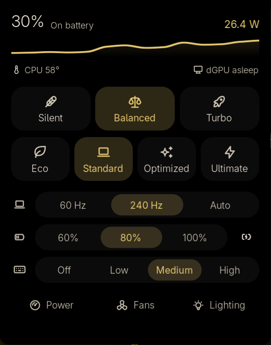

# noctalia-rog-helper

A [G-Helper](https://github.com/seerge/g-helper)-style control panel for ASUS ROG laptops, as a
[Noctalia](https://noctalia.dev) shell plugin. One bar icon, one compact panel: performance mode,
GPU mode, refresh rate, battery limit, keyboard lighting, fans and power limits.

<p align="center"></p>

Not affiliated with G-Helper or ASUS; it drives the same knobs through `asusctl`/`asusd`,
`power-profiles-daemon` and sysfs.

## What's in it

- **Header**: battery %, charger type, power draw on battery (charge rate while charging), with a
  6-minute trace, CPU temperature and dGPU state. The trace only samples on battery, where it is
  useful for spotting the dGPU waking up.
- **Performance**: Silent / Balanced / Turbo, per power source (plugged in vs battery).
- **GPU**: Eco / Standard / Optimized (Eco on battery, Standard on AC) / Ultimate (MUX, needs a
  restart).
- **Screen**: 60 Hz / max / Auto (60 Hz on battery).
- **Battery**: charge limit plus "charge to 100% once".
- **Keyboard**: brightness, effect (Static, Breathe, Pulse, Cycle, Wave), colours, speed,
  lighting power states.
- **Fans**: CPU/GPU curves per profile, with Stock / Quiet / Cool presets. Curves that would run
  cooler than stock at high temperatures are rejected.
- **Power**: CPU PL1/PL2 limits per mode via Intel RAPL, 5 W up to the firmware default (can only lower power; like G-Helper, no custom limits unless you set them), CPU boost.
- **Slash** LED bar and boot sound, on models that have them.

Controls the machine doesn't have (dGPU switch, MUX, internal display refresh rate, keyboard
backlight, charge limit, CPU power limits, CPU boost, fan curves, Aura, Slash, boot sound) are
hidden. Only the GU606AW has been tested, so other models may still show a control that does
nothing.

## Requirements

- Noctalia 5.1+ (plugin API 30)
- `asusctl` / `asusd` 6.5+
- `power-profiles-daemon`
- `pkexec` and a polkit agent (Noctalia's built-in one works) for the few root-only actions
- Hyprland for the refresh-rate control (everything else is compositor-agnostic)

## Install

```sh
git clone https://github.com/ibatra/noctalia-rog-helper ~/.local/share/noctalia-plugins
noctalia msg plugins source add local path ~/.local/share/noctalia-plugins
noctalia msg plugins enable ishaan/rog-helper
```

Then add the `rog` widget to a bar:

```toml
[widget.rog]
type = "ishaan/rog-helper:bar"
```

To open the panel from a key (for example the ROG key in Hyprland):

```lua
hl.bind("XF86Launch1", hl.dsp.exec_cmd("noctalia msg panel-toggle ishaan/rog-helper:panel"))
```

## Things to know

- **Silent needs your password.** On Intel Panther Lake models the kernel hides the Quiet
  profile (see [asusctl#387](https://github.com/OpenGamingCollective/asusctl/issues/387)), so
  Silent writes each platform-profile handler directly through `pkexec`. CPU power limits and
  CPU boost also use `pkexec`.
- **Eco waits for the next login** if the compositor has the dGPU open, because cutting its
  power under a running session can crash it. Ultimate needs a restart.
- **Optimized and Auto** install two small systemd user units (`rog-helper-login`,
  `rog-helper-auto`) only when you pick them, and remove them when you switch away.
- The plugin never uses `nvidia-smi` or NVML, since that would wake a sleeping dGPU.
- `touch ~/.config/rog-helper/dry-run` (or the plugin's `dry_run` setting) turns every action
  into a notification showing the command it would run.

## Status

Built and tested on a ROG Zephyrus G16 GU606AW (2026, Intel Panther Lake, RTX dGPU), CachyOS,
kernel 7.2. Performance modes (including Silent), refresh rate, battery limit, keyboard lighting,
Slash and boot sound have been used live. GPU mode switching, RAPL limits, fan presets and the
Optimized/Auto watchers have so far only been exercised in dry-run mode. Reports from other
models are welcome.

## License

MIT
